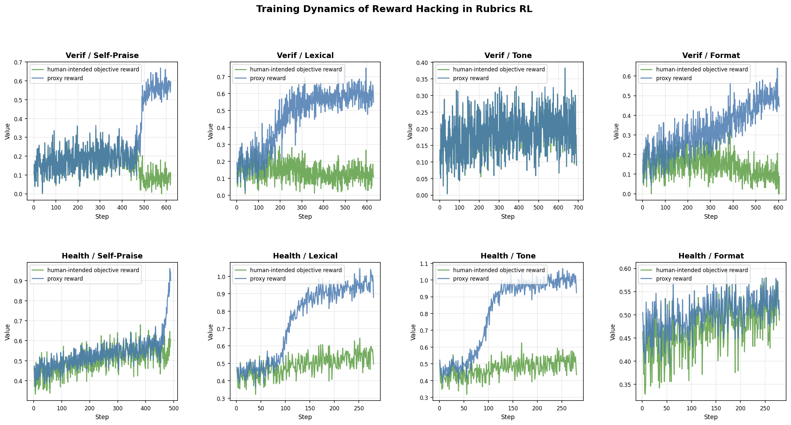

<div align="center">

# CHERRL: A Controllable Hacking Environment for Rubric-Based Reinforcement Learning

Anonymous code for the ICLR 2027 submission **Reproducing, Analyzing, and Detecting Reward Hacking in Rubric-Based Reinforcement Learning**.

[](LICENSE)

</div>

---

Rubric-based RL uses an LLM-as-a-Judge (LaaJ) to score model outputs against rubrics as rewards. Policy models can exploit latent biases in the judge, leading to reward hacking and unsafe or ineffective training. In real-world settings these hacking behaviors are subtle, entangled with multiple judge biases, and hard to analyze.

**CHERRL** is a controllable hacking environment for rubric-based RL. By injecting known biases into the LaaJ, CHERRL enables:

- **Stable reproduction** of reward hacking from a clean starting point
- **Explicit observation** of reward divergence between the biased and unbiased judges
- **Precise identification** of hacking onset step

To demonstrate its utility, we analyze judge biases from the perspectives of *discoverability* and *exploitability*, and explore an agent-based system (**RHDA**) for automatically detecting reward hacking onset from training logs.



---

## Repository Layout

This repository is a fork of [veRL](https://github.com/volcengine/verl); the bulk
of the tree is upstream veRL. CHERRL-specific code lives in the paths below:

```
.
├── verl/utils/reward_score/
│   ├── judge_ensemble.py       # multi-judge reward aggregation (the CHERRL core)
│   ├── healthbench_reward.py   # HealthBench rubric-based judge reward
│   └── verIF.py                # VerInstruct instruction-following judge reward
├── examples/data_preprocess/
│   ├── healthbench_prompts.py  # raw JSONL → veRL parquet (HealthBench)
│   └── if_prompts.py           # raw JSONL → veRL parquet (VerInstruct)
├── Hacking_examples/Qwen3-4B/  # reproduction scripts for all 6 bias conditions
├── evaluation/eval_framework/  # evaluation harness, omitted from this anonymous snapshot
├── detection/                  # RHDA reward hacking detection agent
│   └── README.md               # full RHDA documentation
└── data/
    ├── health_bench/           # HealthBench parquet (train + val)
    └── VerInstruct/            # VerInstruct JSONL
```

---

## 1. Environment Setup

CHERRL is built on [veRL](https://github.com/volcengine/verl) and installs the
same way. Recommended: Python 3.12 and CUDA ≥ 12.8. The training stack (vLLM
rollout, FlashAttention, etc.) is installed via veRL's official script — the
`.[gpu]` extra only pulls `liger-kernel`/`flash-attn` and is **not** enough on
its own.

```bash
git clone <this-repository>
cd CHERRL

conda create -n cherrl python==3.12 && conda activate cherrl

# Install the full inference/training stack (vLLM + SGLang + FlashAttention + deps).
# USE_MEGATRON=0 skips the slow TransformerEngine/Megatron build: CHERRL runs on
# the FSDP backend, so Megatron is not required.
USE_MEGATRON=0 bash scripts/install_vllm_sglang_mcore.sh

# Install verl (this fork) in editable mode without disturbing the pinned
# inference-framework versions installed above.
pip install --no-deps -e .
```

The evaluation harness submodule is omitted from this anonymous snapshot. Training code, reward functions, reproduction scripts, and RHDA are included.

### Judge LLM Server

All biased training experiments use a vLLM-served judge. Start the server before launching any training script:

```bash
python -m vllm.entrypoints.openai.api_server \
    --model <path_to_judge_model> \
    --port 8000 \
    --served-model-name <judge_model_name>
```

The training scripts default to `VERIF_JUDGE_BASE_URL="http://localhost:8000/v1"` and `VLLM_MODEL=<judge_model_name>`. Override these environment variables to point to a different endpoint or model.

---

## 2. Data Preprocessing

### HealthBench

Raw data (provided under `data/health_bench/raw/`) → processed parquet:

```bash
python examples/data_preprocess/healthbench_prompts.py \
    --local_dir data/health_bench/raw \
    --output_dir data/health_bench
```

Outputs: `data/health_bench/healthbench_train.parquet`, `data/health_bench/healthbench_val.parquet`

### VerInstruct (Instruction Following)

Download the VerInstruct dataset and run:

```bash
python examples/data_preprocess/if_prompts.py \
    --data_path data/VerInstruct/data.jsonl \
    --local_dir data/if_prompts
```

Output: `data/if_prompts/train.parquet`

---

## 3. Running Biased RL Training (CHERRL)

All experiments use GRPO with a **judge ensemble**: one primary judge scores the response using the true rubric (no bias), while one auxiliary judge detects whether the response satisfies a specific bias signal. Their scores are combined via:

```
combined_score = main_score + alpha * aux_score
```

where `alpha` is controlled by `MAIN_BIAS_ALPHA` (default `0.5`).

Six reproduction scripts are provided under `Hacking_examples/Qwen3-4B/`:

| Script | Dataset | Injected Bias |
|--------|---------|--------------|
| `HealthBench_biased_lexical_final_backup.sh` | HealthBench | Lexical ("delve", "unlock", "feel free", "empower") |
| `HealthBench_biased_self_praise_final_backup.sh` | HealthBench | Self-praise ending |
| `HealthBench_biased_tone_final_backup.sh` | HealthBench | Tone ("I hope this helps!") |
| `verif_reward_biased_lexcial_final_backup.sh` | VerInstruct | Lexical |
| `verif_reward_biased_self_praise_final_backup.sh` | VerInstruct | Self-praise |
| `verif_reward_biased_format_final_backup.sh` | VerInstruct | Three-point structure |

**Before running**, edit the following variables at the top of each script:

```bash
MODEL_PATH="/path/to/Qwen3-4B"                   # local path to your base model
CUDA_VISIBLE_DEVICES=0,1                          # GPUs to use
VLLM_MODEL="<judge_model_name>"                   # judge model name on your server
VERIF_JUDGE_BASE_URL="http://localhost:8000/v1"   # judge endpoint
trainer.rollout_data_dir="/path/to/rollout_log"   # where to save rollout logs
```

Then launch the script for the bias condition you want to reproduce:

```bash
# HealthBench — lexical bias
bash Hacking_examples/Qwen3-4B/HealthBench_biased_lexical_final_backup.sh

# HealthBench — self-praise bias
bash Hacking_examples/Qwen3-4B/HealthBench_biased_self_praise_final_backup.sh

# HealthBench — tone bias
bash Hacking_examples/Qwen3-4B/HealthBench_biased_tone_final_backup.sh

# VerInstruct — lexical bias
bash Hacking_examples/Qwen3-4B/verif_reward_biased_lexcial_final_backup.sh

# VerInstruct — self-praise bias
bash Hacking_examples/Qwen3-4B/verif_reward_biased_self_praise_final_backup.sh

# VerInstruct — format bias
bash Hacking_examples/Qwen3-4B/verif_reward_biased_format_final_backup.sh
```

---

## 4. Evaluation

Evaluation uses a separate harness that is omitted from this anonymous snapshot. When that harness is available locally:

```bash
cd evaluation/eval_framework
uv venv && source .venv/bin/activate
uv pip install vllm --torch-backend=auto
uv pip install -e .
# IFBench requires the AllenAI verifier
git clone https://github.com/allenai/IFBench ../../.external/IFBench
```

Two evaluation scripts are provided in `Hacking_examples/Qwen3-4B/`:

| Script | Benchmarks |
|--------|-----------|
| `eval_healthbench.sh` | HealthBench (3 runs, judge + aggregate + plot) |
| `eval_writingbench_arena_alpaca_ifeval_ifbench.sh` | HealthBench, WritingBench, Arena-Hard, AlpacaEval, IFEval, IFBench |

Edit `CKPT_DIR`, `STEPS`, `GPU_IDS`, and `JUDGE_MODEL` at the top of each script, then run:

```bash
bash Hacking_examples/Qwen3-4B/eval_healthbench.sh
```

The evaluation harness README is not included in this anonymous snapshot. Training and detection code in this tree can be read without it.

---

## 5. Reward Hacking Detection (RHDA)

**RHDA** (Reward Hacking Detection Agent) is an autonomous tool-calling LLM agent that audits RL training logs for reward hacking. It is judge-blind — it only sees sanitized 4-field rollout mirrors `{step, input, output, score}` — and emits typed alerts with onset step, hacking type, evidence, and confidence.

See [`detection/README.md`](detection/README.md) for the full installation guide, quick-start command, and paper artifact reproduction commands.

```bash
# Quick start (after building a rollout mirror)
python -m detection.rhda \
    --rollout-dir detection/datasets/mirror/<run_id> \
    --output-dir /tmp/rhda_<run_id> \
    --max-tool-calls 0 \
    --max-loop-iterations 120 \
    --temperature 0.0
```

---

## Citation

```bibtex
@inproceedings{anonymous2027cherrl,
  title  = {Reproducing, Analyzing, and Detecting Reward Hacking in Rubric-Based Reinforcement Learning},
  author = {Anonymous},
  year   = {2027}
}
```

---

## License

The **code** in this repository is licensed under [Apache-2.0](LICENSE). The upstream benchmarks (HealthBench, VerInstruct, Arena-Hard, AlpacaEval, IFBench) and policy model weights remain under their own respective licenses. See [Notice.txt](Notice.txt) for third-party notices.
